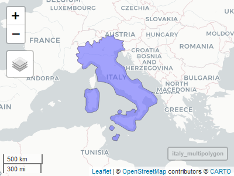

<!-- README.md is generated from README.Rmd. Please edit that file -->

# polyread

<!-- badges: start -->

[](https://www.tidyverse.org/lifecycle/#experimental)
[](https://CRAN.R-project.org/package=polyread)
<!-- badges: end -->

The goal of polyread is to read Polygon Filter File Format (`.poly`)
files (which are defined
[here](https://wiki.openstreetmap.org/wiki/Osmosis/Polygon_Filter_File_Format)),
and convert them to
[`sfc`](https://r-spatial.github.io/sf/reference/sfc.html) format.

## Installation

You can install the development version of `polyread` with:

``` r
remotes::install_github()
install.packages("polyread")
```

## Example

This is a basic example which shows you how to solve a common problem:

``` r
library(polyread)

## basic example code: read a poly file and convert to MULTIPOLYGON
africa_url <- "http://download.openstreetmap.fr/polygons/africa.poly"
africa_con <- url(africa_url)
africa_poly <- readLines(africa_con); close(africa_con) # don't forget to close the connection
(africa_multipolygon <- convert_poly_to_sfc(africa_poly))
#> Geometry set for 1 feature 
#> geometry type:  MULTIPOLYGON
#> dimension:      XY
#> bbox:           xmin: -30.8363 ymin: -60.3167 xmax: 61.62511 ymax: 37.77817
#> geographic CRS: WGS 84
#> MULTIPOLYGON (((11.60092 33.99875, 11.60207 37....
```

A map:

``` r
italy_con <- url("http://download.openstreetmap.fr/polygons/europe/italy.poly")
italy_poly <- readLines(italy_con); close(italy_con)

italy_multipolygon <- convert_poly_to_sfc(italy_poly)
mapview::mapview(italy_multipolygon)
```



## Code of Conduct

Please note that the polyread project is released with a [Contributor
Code of
Conduct](https://contributor-covenant.org/version/2/0/CODE_OF_CONDUCT.html).
By contributing to this project, you agree to abide by its terms.
